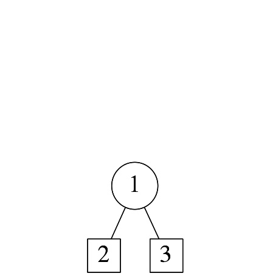
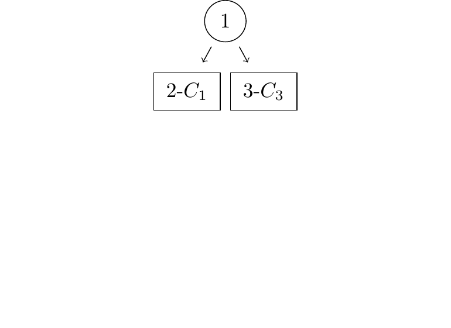
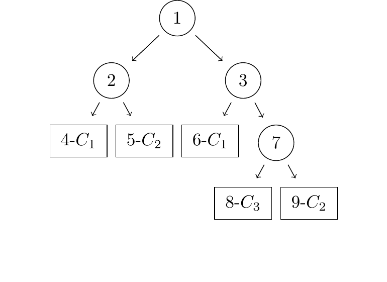
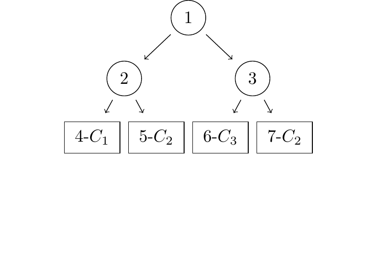
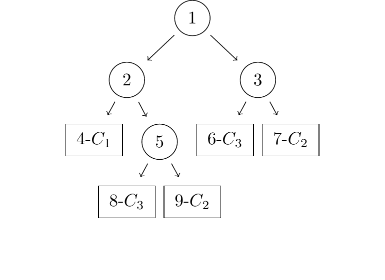
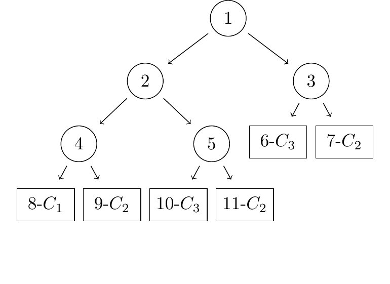
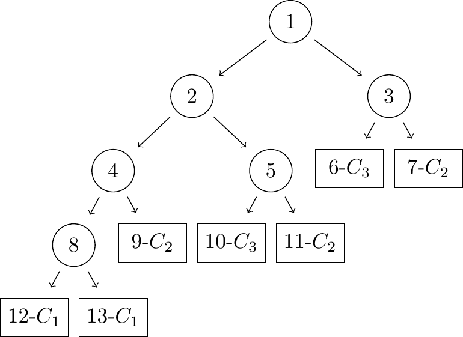
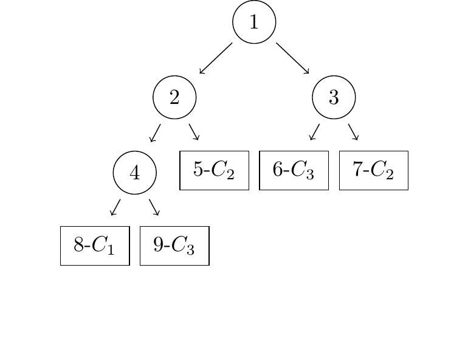
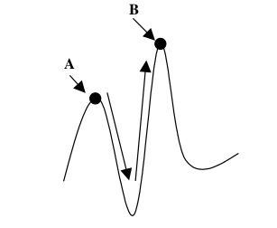
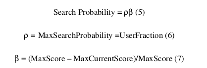

.. include:: conf.rst

|algo| algorithm
================

This section describes an evolutionary algorithm for oblique full DT induction using supervised learning - |algo|. The main motivation for creating |algo|, was to develop an algorithm that is:

- Suitable for the implementation on embedded systems, i.e. has low hardware resource requirements,
- Easy parallelizable and accelerated in hardware, and
- Induces smaller DTs than the existing solutions, without the loss in DT accuracy.

The algorithm overview
----------------------

The :num:`Algorithm #fig-algorithm-pca` shows the algorithmic framework for the |algo| algorithm, which is similar for all evolutionary algorithms and comprises main tasks of the individual mutation, fitness evaluation and selection. The DT is induced from the training set - the argument *train_set* received by the *efti()* function. Since the |algo| algorithm performs supervised learning, the training set consists of problem instances which have the known class membership. The |algo| algorithm maintaines a single candidate solution, stored in the variable *dt* in pseudo-code. The evolution is started from the randomly generated one-node DT (containing only the root) by the *initialize()* function and iteratively the effort is made to improve on it. In each iteration, DT is slightly changed by the *mutate()* function to obtain the mutated individual stored into the *dt_mut* variable. Two types of mutations are employed on the DT individual:

- Every iteration a small number of randomly selected coefficients in the certain number of randomly selected nodes are changed, and
- Every few iterations, a node is either added or removed from the DT

The fitness of the mutated individual (variable *fit_mut*), calculated by the *fitness_eval()* function, is then compared with the fitness of the candidate solution individual (variable *fit*) by the *selection()* function, which decides whether the mutated individual will be taken as the new candidate solution, i.e. will it become the base for the mutation in the iterations to follow. During *max_iter* iterations the |algo| algorithm tries to improve upon the DT candidate solution, after which the algorithm exits and the candidate solution is returned. Once the DT is formed in this way, it can be used to classify new instances of the problem.

.. _fig-algorithm-pca:

.. literalinclude:: code/algorithm.py
    :caption: Overview of the |algo| algorithm

In the :num:`Figure #fig-efti-overview00` through :num:`Figure #fig-efti-overview07`, one example evolution of the DT by the |algo| algorithm is shown. Eight specific moments in the DT evolution, where significant breakthroughs in the fitness of the DT were made, are presented in these figures by both plotting their tree structure, and displaying the partition of the attribute space that these individuals induce. The nodes are drawn using circles and the leaves using squares, and each node and each leaf is assigned a unique ID. Each leaf node and the attribute space region is labeled in the format *i-Cj*, where *i* equals the ID of the leaf, that also corresponds to the region, and *j* equals the class number assigned to the leaf, hence also to the region. For each of these figures, the following information is given:

- Iteration - the iteration number in which the DT individual was evolved
- Fitness - the fitness of the DT
- Size - the size of the DT: calculated as the number of leaves in the DT
- Accuracy - the accuracy of the DT on the training set: calculated as the percentage of the instances from the training set that are classified correctly

.. subfigstart::

.. _fig-efti-overview-dot00:

    The initial one-node DT generated by the *initialize()* function

.. _fig-efti-overview-attr00:

.. figure:: images/efti_overview_dts/dt00.pdf
    :width: 93%
    :align: center

    The initial attribute space partition

.. subfigend::
    :width: 0.48
    :label: fig-efti-overview00

    Iteration: 000000, Fitness: 0.602, Size: 2, Accuracy: 0.600

.. subfigstart::

.. _fig-efti-overview-dot01:

    No added nodes that were tried managed to increase fitness

.. _fig-efti-overview-attr01:

.. figure:: images/efti_overview_dts/dt01.pdf
    :width: 93%
    :align: center

    Position of the split shifted to increase the accuracy

.. subfigend::
    :width: 0.48
    :label: fig-efti-overview01

    Iteration: 000013, Fitness: 0.629, Size: 2, Accuracy: 0.627

.. subfigstart::

.. _fig-efti-overview-dot02:

    Three new nodes added to increase the accuracy

.. _fig-efti-overview-attr02:

.. figure:: images/efti_overview_dts/dt02.pdf
    :width: 93%
    :align: center

    Three new splits added for finer attribute space partition

.. subfigend::
    :width: 0.48
    :label: fig-efti-overview02

    Iteration: 003599, Fitness: 0.914, Size: 5, Accuracy: 0.920

.. subfigstart::

.. _fig-efti-overview-dot03:

    Since the region of leaf #6 contained almost no individuals in the :num:`Figure #fig-efti-overview-attr02`, it was removed and the node #7 was basically moved up to replace node #3 (:num:`Figure #fig-efti-overview-dot02`), and thus removing the said empty region.

.. _fig-efti-overview-attr03:
.. figure:: images/efti_overview_dts/dt03.pdf
    :width: 93%
    :align: center

    The region of the leaf #6 (:num:`Figure #fig-efti-overview-attr02`) was removed, since it was almost empty and contributed little to accuracy. The resulting DT is smaller, with even a slight increase in accuracy (since the split induced by node 1 has also shifted slightly to a better position).

.. subfigend::
    :width: 0.48
    :label: fig-efti-overview03

    Iteration: 007859, Fitness: 0.927, Size: 4, Accuracy: 0.930

.. subfigstart::

.. _fig-efti-overview-dot04:

    The leaf #5 was made into a node

.. _fig-efti-overview-attr04:
.. figure:: images/efti_overview_dts/dt04.pdf
    :width: 93%
    :align: center

    Small increase in accuracy was obtained by further dividing the central region of the attribute space, where the individuals of all three classes overlap

.. subfigend::
    :width: 0.48
    :label: fig-efti-overview04

    Iteration: 030268, Fitness: 0.927, Size: 5, Accuracy: 0.933

.. subfigstart::

.. _fig-efti-overview-dot05:

    The leaf #4 was now made into a node

.. _fig-efti-overview-attr05:
.. figure:: images/efti_overview_dts/dt05.pdf
    :width: 93%
    :align: center

    Again, further division of cental attribute space region produced a small increase in accuracy. Fitness has progressed even less, since the addition of a new node diminished the advantage of a small accuracy increase.

.. subfigend::
    :width: 0.48
    :label: fig-efti-overview05

    Iteration: 177050, Fitness: 0.927, Size: 6, Accuracy: 0.937

.. subfigstart::

.. _fig-efti-overview-dot06:

    The leaf #8 was split into two

.. _fig-efti-overview-attr06:
.. figure:: images/efti_overview_dts/dt06.pdf
    :width: 93%
    :align: center

    The region of leaf #8 was split, bringing no improvement to the class separation, but with some other shifts in the split positions, some small accuracy gain was achieved

.. subfigend::
    :width: 0.48
    :label: fig-efti-overview06

    Iteration: 279512, Fitness: 0.927, Size: 7, Accuracy: 0.940

.. subfigstart::

.. _fig-efti-overview-dot07:

    Leaf #9 was removed together with the node #4, which brought the node #8 up in the place of the node #4. Leaves #10 and #11 were removed, and the node #5 was reverted to leaf again.

.. _fig-efti-overview-attr07:
.. figure:: images/efti_overview_dts/dt07.pdf
    :width: 93%
    :align: center

    |algo| gave up on finely partitioning the central attribute space region, since very little gain in accuracy could not justify the increase in the DT size, and it managed to produce the smaller DT without sacrificing the accuracy. The split by the node #8 between the regions #12 and #13 in the :num:`Figure #fig-efti-overview06`, became the split between the regions #8 and #9 after the node #8 moved up to replace the node #4. This, once useless split, has now shifted to turn out very usefull in separating instances of the classes :math:`C_1` and :math:`C_3` and hence contributing to the accuracy.

.. subfigend::
    :width: 0.48
    :label: fig-efti-overview07

    Iteration: 415517, Fitness: 0.934, Size: 5, Accuracy: 0.940

At the beggining of the |algo| algorithm, the initial individual needs to be generated (:num:`Figure #fig-efti-overview00`). Since |algo| has a goal of creating DTs as small as possible, the initial individual will be first created empty and than only the root node will be generated and inserted into it. By the iteration 13 (:num:`Figure #fig-efti-overview01`), no new nodes were added, but the root node test was modified to produce the increase in the DT accuracy from 0.6 to 0.627. During the further evolution the nodes are added, which raises the accuracy of the DT. Notice how fitness becomes to deviate from the accuracy when more nodes are added. This is because the fitness also depends on the size of the DT, in that it is penalized the more leaves the DT has. In this example, the biggest drop in the fitness because of the DT size is in the iteration 279512 of the DT evolution (:num:`Figure #fig-efti-overview06`), where the DT individual comprises 7 leaves and although the accuracy climbs to 0.94 (classification success rate of 94%), the fitness remains at 0.927. In this way, the evolutionary process is forced to search for the smaller DT solutions, in which it eventually succeds by the iteration 415517 (:num:`Figure #fig-efti-overview07`), where the DT size drops to only 5 leaves without affecting the accuracy.

Detailed description
--------------------

In this section, the detailed descriptons of individual |algo| subtasks is given. Although |algo| was based on the HereBoy algorithm, it both deviates from HereBoy in some aspects (for an example: the mutation strength profile and selection procedure) and implements many operations that are specific to the full DT induction and not present in the HereBoy (for an example: tree structure mutation and fitness calculation specifics).

Mutation
........

The |algo| algorithm performs two types of mutations on the DT individual:

- The node test coefficients mutation
- The DT topology mutation

During each iteration of the |algo| algorithm, a small portion (|alpha|) of DT nodes' test coefficients is mutated at random. To improve the convergence of the DT optimization procedure, higher probability of being mutated is assigned to the nodes whose sub-trees contain leaves with higher impurity (the variable *impurity* in the :num:`Algorithm #fig-algorithm-pca`), which is calculated by the *fitness_eval()* function. Please notice that every DT leaf has a class assigned to it, as shown in the :num:`Figure #fig-oblique-dt-traversal`, and not all training set instances that finish in a leaf must belong to its class. The impurity measures the percentage of the training set instances that finished in a leaf, but belong to a different class than that of the leaf. The nodes whose subtrees contain leaves with high impurity values are good candidates for further optimizations that could lead to significant improvements in the evolved DT accuracy, thus improving the convergence of the |algo| algorithm.

When the node test coefficients mutation is performed, the selected coefficient is mutated by flipping one of its bits at random position. Every change in the node test influences the classification, as the instances take different paths through the DT, hence being classified differently. Usually, one coefficient per several nodes (dictated by the parameter |alpha|) is mutated in each iteration, in order for the classification result to change in small steps. The parameter |alpha| is adapted dynamically from one iteration to the other, depending on the speed at which the DT fitness is improving, in a manner that |alpha| is increased in each iteration when there is no improvement, and reset to default minimal value when a new individual is selected as the current best.

On the other hand, the topology mutations represent very large moves in the search space, so they are performed even less often. In every iteration, there is a small chance (|rho|) that a node will either be added to the DT or removed from it. This change either adds an additional test for the classification, or removes one or whole subtree of tests. The node is always added in place of an existing leaf, i.e. never in place of an internal non-leaf node. The leaves with higher impurity have higher probability of being selected for this mutation. The test coefficients of the newly added non-leaf node are calculated in the same way as are the root test coefficients during the DT initialization. On the other hand, if a node is to be removed, it is always one of the non-leaf nodes. By adding a test, a new point is created, where during the classification, instances from different classes might separate and take different paths through the DT and eventually be classified as different, which can increase the accuracy of the DT. On the other hand, by removing unnecessary tests, the DT is made smaller. The size of the DT is also an important factor in the fitness calculation in the |algo| algorithm.

The DT node insertion algorithm
...............................

Each time a node is to be added to the DT, both the root node in the initialization procedure and any other node by mutation, the node's test needs to be initialized. In order to allow for wider search space exploration, the node tests are generated at random, but they still need to be guided by the structure of the training set to speed up the convergence of the evolutianary algorithm towards the optimal solution. One of the approaches for the random initialization basically ensures that two randomly selected training set instances (called a mixed dipole) take different paths during classification at the node being initialized, and is suggested in :cite:`krketowski2005global`. The mixed dipole is defined by two instances from the training set that belong to different classes. As shown in :num:`Figure #fig-dipole-hyperplane`, the procedure consists of placing the hyperplane :math:`H_{ij}(\mathbf{w},\theta)` in the attribute space, perpendicular to the line connecting the mixed dipole :math:`(\mathbf{x}^i, \mathbf{x}^j)`. The hyperplane corresponds to the node test given by the equation :eq:`oblique-test`, where |w| is the test coefficient vector and |th| is the test threshold. The example attribute space in :num:`Figure #fig-dipole-hyperplane` has two dimensions, one for each of the attributes :math:`x_1` and :math:`x_2`. The hyperplane exact position is further fixed by randomly generated parameter :math:`\delta \in (0,1)`, which determines whether the hyperplane is placed closer to :math:`\mathbf{x}^i` (for :math:`\delta < 0.5`), or closer to :math:`\mathbf{x}^j` (for :math:`\delta > 0.5`). Mathematically, the equation for the hyperplane generated by the method of the mixed dipole described in this paragraph is obtained in the following way:

.. math::
    :label: eq-rnd-dipole-hyperplane

    H_{ij}(\mathbf{w},\theta) &= \mathbf{w}\begin{pmatrix}x_1\\x_2\end{pmatrix} - \theta,\\
    \mathbf{w} &= (\mathbf{x}^i - \mathbf{x}^j),\\
    \theta &= \delta\mathbf{w}\cdot\mathbf{x}^i + (1-\delta)\mathbf{w}\cdot\mathbf{x}^j

.. _fig-dipole-hyperplane:
.. plot:: images/dipole_hyperplane_plot.py
    :width: 80%

    Initialization of the node tast based on the randomly chosen dipole :math:`H_{ij}(\mathbf{w},\theta)` is a hyperplane corresponding to the node test, |w| is coefficient vector, and |th| is the threshold. The attribute space shown in the figure has two dimensions, one for each of the attributes :math:`x_1` and :math:`x_2`.

This procedure aims to introduce a usefull test into the DT, based on the assumption that the instances of the same class are somehow grouped in the attribute space, and that the test produced in this way will help separate the instances belonging to the instances of the dipole.

Fitness evaluation
..................

The DT can be optimized with respect to various parameters, where the DT accuracy and its size are usually the most important. However, there are many more parameters of interest, like the number of training set classes not represented in the DT, the purity of the DT leaves, the deegree at which the DT is balanced, etc. Hence, in order to solve this multi-objective optimizational problem with the evolutionary approach, a fitness function needs to be defined to effectively collapse it to a single objective optimizational problem. This can be done in various ways, and here one procedure to do it is given.

.. _fig-fitness-eval-pca:

.. literalinclude:: code/fitness_eval.py
    :caption: The pseudo-code of the fitness evaluation task.

Accuracy calculation
;;;;;;;;;;;;;;;;;;;;

The main task of the optimization procedure is to maximize the accuracy of the DT individual on the training set. The accuracy is calculated by letting the DT individual classify all problem instances from the training set and then comparing the classification results to the desired classifications, specified in the training set. The pseudo-code for this task is given in the :num:`Algorithm #fig-accuracy-calc-pca`. The input parameter *dt* is the current DT individual and *train_set* is the training set.

.. _fig-accuracy-calc-pca:

.. literalinclude:: code/accuracy_calc.py
    :language: python3
    :caption: The pseudo-code of the accuracy calculation task.

First, the class distribution is determined, by letting all instances from the training set traverse the DT, i.e. by calling the *find_dt_leaf_for_inst()* function whose pseudo-code is given in the :num:`Algorithm #fig-find-dt-leaf-for-inst-pca`. This function determines the instance traversal path, and returns the leaf node in which the instance finished the traversal. The traversal starts at the root node (accessed via *dt.root*), and is performed in the manner depicted in the :num:`Figure #fig-oblique-dt-traversal`, where one possible path is given by the red line. Until a leaf is reached, the node test is performed and a decision to which child to proceed is made based on it. The function *dot_product()*, calculates the scalar product of the node test coefficient vector |w| (stored in *cur_node.w* attribute), and the attribute vector of the instance |x| (stored in *instance.x* variable), and the value returned is compared with the node test threshold |th| (stored in *cur_node.thr* attribute).

.. _fig-find-dt-leaf-for-inst-pca:

.. literalinclude:: code/find_dt_leaf_for_inst.py
    :caption: The pseudo-code of the procedure for determining the end-leaf for an instance.

Next step in the accuracy calculation process (the first for loop in the :num:`Algorithm #fig-accuracy-calc-pca`) is to calculate the class distribution matrix. The distribution matrix has one row for each DT leaf, i.e. for each attribute space partition induced by the DT. Each row in turn contains one element for each of the classes in the training set. Hence, a row of the distribution matrix contains the statistics on how many instances of each of the training set classes finished the traversal in the leaf corresponding to the row.

The classes of all the instances from the training set are known and accessed for each instance via the attribute *instance.cls* (within the *accuracy_calc()* function). Based on the leaf nodes' IDs, returned by the *find_dt_leaf_for_inst()* function and the instances class, the distribution matrix is updated. The :math:`d_{i,j}` element of the distribution matrix contains the number of instances of the class *j* that finished in the leaf node with the ID *i* after the DT traversal. After all the instances from the training set traverse the DT, this matrix contains the distribution of classes among the leaf nodes.

The second for loop of the *accuracy_calc()* function finds the dominant class for each leaf node. The dominant class for a leaf node is the class having the largest percentage of instances finishing the traversal in that leaf node. Formally, the dominant class :math:`k_i` of the leaf node with the ID *i* is:

.. math:: k_i | (d_{i,k} = \max_{j}(d_{i,j}))
    :label: dominant_class

.. _fig-distribution-matrix:

.. bdp:: images/distribution_matrix.py
    :width: 80%

    The distribution matrix

If we were to do a classification run with the current DT individual over the training set, the maximum accuracy would be attained if all leaf nodes were assigned their corresponding dominant classe. Thus, each instance which finishes in a certain leaf node, that is of the node's dominant class, is added to the number of classification hits (the *hits* variable of the :num:`Algorithm #fig-accuracy-calc-pca`), otherwise it is qualified as a missclassification. The accuracy of the DT is hence the percentage of the instances whose classifications were declared as hits: *accuracy* = *hits* / len(*train_set*).

Oversize
;;;;;;;;

The DT oversize is calculated as the relative difference between the number of leaves in the DT and the total number of classes (|Nc|) in the training set (obtained via the *train_set.cls_cnt()* function). In order to be able to classify correctly all training set instances, after the DT induction, the DT needs to have at least one leaf for each class occurring in the training set. Therefore, the DT starts to suffer penalties to the fitness only when the number of the DT leaves exceeds the total number of classes in the training set, given by :eq:`eq-oversize`.

.. math:: oversize = \frac{\Nl - \Nc}{\Nc}
    :label: eq-oversize

DT oversize negatively influences the fitness as it can be seen from the way fitness is calculated in the :num:`Algorithm #fig-fitness-eval-pca`: *fitness = accuracy \* (1 - Ko*oversize)*. The parameter |Ko| is used to control how much influence oversize will have on overall fitness. In other words, it determines the shape of the collection of Pareto frontiers for the DT individual. Each DT individual can be represented as a point in a 2-D space induced by DT oversize and accuracy measures. A Pareto set is formed for each possible fitness value, where all elements of the set are assigned the same fitness value, even though they have different accuracy and oversize measures.

.. _fig-fit-overSize:
.. plot:: images/pareto.py
    :width: 90%

    Position of Pareto frontiers for accuracy value of 0.8, when |Nc| equals 5, for |Ko| parameter values of: 0, 0.1 and 0.2.

The :num:`Figure #fig-fit-oversize` shows the position of the Pareto frontier for an example of fitness value of 0.8 and few values of the parameter |Ko|. Also, fot this example, it was taken for |Nc| to be equal 5. It can be seen that if |Ko| is chosen to be 0, the oversize does not influence the fitness which is always equal to the accuracy value. When :math:`K_o > 0`, the |algo| algorithm will be willing to trade accuracy for the DT size. As it can be seen from the figure, the DT individuals of size 2 and accuracy of 0.72 are equally fit for the algorithm as the one of size 10 and almost perfect accuracy of 1.

Selection
.........

The selection task is responsible for deciding in each iteration which DT will be taken for candidate solution for the next Iteration: either the current candidate solution, i.e. the parent, or the mutated individual. Whenever the mutated individual outperforms its parent in fitness, it is always taken as the new candidate solution.

**Iz HEREBOY rada, prepevati**

.. literalinclude:: code/selection.py
    :caption: The pseudo-code of the *selection()* function of the |algo| algorithm, that implement's the individual selection procedure

Evolving a solution is inherently an unpredictable process. Like running a maze and only seeing what is in the immediate vicinity, sometimes the system runs into a local dead-end and needs to backtrack to the main path. Consider :num:`Figure #fig-escaping-local-maxima`, a simple 1-dimensional curve of a scoring function. At point A, the solution is at a local maximum, all points in its neighborhood having lower scores. In order to get to point B the solution has to first traverse through the lower scoring regions in order to get to the base of the hill from which it can start scaling to a better solution. The probability test to accept poorer performing solutions is a process that allows the system to search its surrounding neighborhood for better opportunities. Without a search, the system would tend to get stuck at local maximas.

.. _fig-escaping-local-maxima:

    Escaping a local maxima

**Ovo cak nije ni uradjeno, probati da li unapredjuje rezultate**

This concept is well documented in the Simulated Annealing literature. The test probability starts off with high values and reduces over time. This is referred to in the literature as the cooling schedule. The basic idea is to allow the system a lot of freedom at the beginning of the run when the system is in a high state of disorder in order to allow it to search for optimal structures. Then as structures emerge the freedom is reigned in so that the structures aren’t destroyed. Typically cooling schedules are predefined, although it has been shown that adaptive schedules produce better results.

HereBoy employs an adaptive scheme to reduce the search probability. The search probability is defined by Formula 5 which closely resembles the adaptive mutation rate formula. Again, the output is the product of two terms: the maximum search probability (ρ) and a fractional term that reduces from 1 to 0 as the process converges (β). The maximum search probability is a user-defined parameter between 0 and 1. It defines the maximum chance that a poor performing mutation will be accepted. The fractional term is identical to the one in the adaptive mutation rate formula and performs the same function, to reduce the output from the maximum to 0 as the process converges.

.. _fig-adaptive-search-eq:

    The equations explaining the adaptive search

Improvements to the |algo| algorithm
------------------------------------

Percentage of missing classes
.............................

The percentage of missing classes is calculated as the percentage of the classes for which the DT does not have a leaf, to the total number of classes in the training set (|Nc|):

.. math:: missing = \frac{\Nc - N_{DTc}}{\Nc}
    :label: eq-missing

where |NDTc| is the number of classes represented in the DT leaves. The fitness calculation is then updated so that the penalties are taken for the missing classes in the DT individual: *fitness = accuracy \* (1 - Ko*oversize) \* (1 - Km*missing)*, where the parameter |Km| is used to control how much influence the number of missing classes will have on overall fitness.

Return to best
..............

Impurity
........

Delta classification
....................

The fitness evaluation task performs the following:

- Finding the distribution of the classes over the leaves of the DT - implemented by the first **for** loop
- Finding the dominant class and the impurity for each leaf, and creating a list of classes that were assigned as dominant to at least one leaf in the current DT - implemented by the second **for** loop
- Calculating the fitness as a combination of different factors: the DT accuracy, the DT oversize and the percentage of missing classes, i.e. the classes that were not assigned to a leaf in the current DT - implemented by the last five statements.

Please notice that the DT mutations alter only a small portion of the DT in each iteration. Hence, majority of instances will travel along identical paths from iteration to iteration, meaning that all related computations will remain the same. Recomputation is thus only necessary for the instances whose paths contain a mutated node. Please also notice that even when the mutated node test coefficients change, only corresponding elements of the vector scalar product sum (given in the equation :eq:`oblique-test`) must be recomputed, while the computation of all other elements can be skipped.

To implement the optimizations mentioned above, the |algo| algorithm memorizes, for each instance, the traversal path and the vector scalar products of the node tests along the path. In the subsequent iterations, this data is used to eliminate the unnecessary node test evaluations in the following way:

- As long as an instance stays on the same path as it took in the iteration before, the node tests are not evaluated and the path information is retrieved from the memory by calling the *get_next_node_from_stored_path()* function.
- When an instance reaches the node that has been mutated, the vector scalar product can be updated based on the memorized value from the iteration before. By updating only those elements of the vector scalar product sum whose node test coefficients were changed by the mutation, the multiplication and addition operations for all other elements can be skipped. This is performed by calling the *update_node_test_sum()* function. If the newly calculated sum causes the instance to change its traversal path, variable *path_diverged* is set to *True* indicating that the remainder of the traversal path has to be completely recalculated.

The *calculate_node_test_sum()* function is used to recalculate and store the vector scalar product of the subsequent node tests, while the *update_instance_path()* function updates the stored instance traversal path.

Complexity of the |algo| algorithm
----------------------------------

The computational complexity of the |algo| algorithm can be calculated using the algorithm pseudo-code. The computational complexity will be given in the big O notation. Since the individual selection is performed in constant time it can be omitted, and the total complexity can be computed as:

.. math:: T(EFTI) = max\_iter\cdot(O(mutate) + O(fitness\_eval))
    :label: cplx_algo_tot_components

Let *n* be the number of non-leaf nodes in the DT. In the worst case, the depth of the DT equals the number of non-leaf nodes:

.. math:: D=n
	:label: depth

Let |NA| equal the size of attribute (|x|) and coefficient (|w|) vectors. Each non-leaf node in the DT has |NA| + 1 (*thr*) coefficients, and the portion |alpha| is mutated each iteration, so the complexity of mutating coefficients is:

.. math:: T(coefficient\ mutation) = O(\alpha \cdot n \cdot \NA)
	:label: cplx_mut_coef

The topology can be mutated by either adding or removing the node from the DT. When the node is removed, only a pointer to the removed child is altered so the complexity is:

.. math:: T(node\ removal) = O(1)
	:label: cplx_rem_node

When the node is added, the new set of node test coefficients needs to be calculated, hence the complexity is:

.. math:: T(node\ addition) = O(\NA)
	:label: cplx_add_node

Since :math:`\rho\ll\alpha\cdot n`, the complexity of the whole DT Mutation task sums to:

.. math:: T(mutation) = O(\alpha \cdot n \cdot \NA + \rho (O(1)+O(\NA))) = O(\alpha \cdot n \cdot \NA)
    :label: cplx_mutation

Let |NI| be the number of instances in the training set, |Nl| the number of leaves and |Nc| the total number of classes in the classification problem. The number of leaves in binary DT is:

.. math:: N_l = n + 1
    :label: leaves_cnt

Once the number of hits is determined, the fitness can be calculated in constant time :math:`O(1)`, hence the complexity of the whole *fitness_eval()* function is:

.. math:: T(fitness\_eval) = N_I\cdot O(find\_dt\_leaf\_for\_inst) + O(N_l\cdot N_c) + O(1)
    :label: fitness_eval

As for the *find_dt_leaf_for_inst()* function, the complexity can be calculated as:

.. math:: T(find\_dt\_leaf\_for\_inst) = D\cdot O(calculate\_node\_test\_sum),
    :label: find_dt_leaf

and the complexity of the node test evaluation is:

.. math:: T(calculate\_node\_test\_sum) = O(\NA)
    :label: node_test_eval

By inserting the equation :eq:`node_test_eval` into the equation :eq:`find_dt_leaf`, and then both of them into the equation :eq:`fitness_eval`, we obtain the complexity for the *fitness_eval()* function:

.. math:: T(fitness\_eval) = O(N_{I}\cdot D\cdot\NA + \Nl\cdot N_c)
    :label: fitness_eval_tot

By inserting the equations :eq:`fitness_eval_tot`, :eq:`cplx_mutation`, :eq:`leaves_cnt` and :eq:`depth` into the equation :eq:`cplx_algo_tot_components`, we obtain the total complexity of the |algo| algorithm:

.. math:: T(EFTI) = max\_iter\cdot(N_I\cdot n\cdot\NA + n\cdot N_c + \alpha \cdot n \cdot \NA)
    :label: cplx_all_together

Since :math:`\alpha\cdot n \ll N_I\cdot n` the mutation insignificantly influences the complexity and can be disregarded. We finally obtain that complexity of the |algo| algorithm is dominated by the fitness evaluation task complexity, and sums up to:

.. math:: T(EFTI) = O(max\_iter\cdot(N_I\cdot n\cdot\NA + n\cdot N_c))
    :label: cplx_final

It is clear from the equation :eq:`cplx_final` that the *fitness_eval()* function is a good candidate for the hardware acceleration, while the mutation tasks can be left in the software since they insignificantly influence the complexity of the |algo| algorithm.

Software implementations
------------------------

PC implementation
.................

- deljenje hits/inst_cnt nije potrebno, jer je uvek isti inst_cnt
- deljenje sa Nc nije potrebno

ARM implementation
..................

DSP implementation
..................

Experiments
-----------

Conducted experiments were devised to compare the performance of evolved DTs using the proposed EFTI algorithm with the DTs inferred using some of the previously proposed algorithms. In particular, DTs were compared by their size and accuracy.

In total, 21 different datasets from the UCI machine learning repository [36] have been used in the experiments: Wisconsin Breast Cancer (bcw), Pima Indians Diabetes (pid), Glass Identification (gls), Iris Plants (irs), Vehicle Silhouettes (veh), Vowel Recognition (vow), Statlog Heart Disease (hrts), Australian Credit Approval (ausc), Hepatitis Domain (hep), Lymphography Domain (lym), Balance Scale Weight & Distance (bc), Zoo (zoo), 1984 United States Congressional Voting Records (vote), Ionosphere (ion), Sonar (son), Contraceptive Method Choice (cmc), German Credit (ger), Liver Disorders (liv), Page Blocks Classification (page), Thyroid Disease (thy) and Waveform 40 (w40). Only change to the original datasets was that the instances with missing values have been removed from the datasets.

All reported results are the averages of the five ten-fold cross-validation experiments. Experimental setup was the following. Each dataset D, was divided into 10 non-overlapping sets, D1, D2, … D10, by randomly selecting the instances from D using uniform distribution. In each cross-validation run, a DT was created using a selected DT inference algorithm. During the inference process, D\Di set was used as the training set. Inferred DT was than tested using Di set as the test set. This procedure was repeated 5 times, resulting in 50 inferred DTs for each dataset and for each DT inference algorithm. Using these sets of 50 DTs, average inferred DT size, measured as the number of DT leafs, was calculated for every dataset and every DT inference algorithm. Using test set classification accuracies, calculated as a percentage of correctly classified test set instances, average DT classification accuracy for every dataset and DT inference algorithm has been also calculated. Both the DT size and test set classification accuracy are reported with 95% confidence intervals.

For DT inference algorithms that require DT pruning a pruning set has been created, taking 30% of the training set instances selected randomly, and used to prune the DT.

In the performance comparison process, following incremental DT inference algorithms have been used:

# OC1-AP, Oblique Classifier Algorithm developed and used by S. K. Murthy and others in [16], but limited to using only axis-parallel tests,
# OC1, developed and used by S. K. Murthy and others with default parameters [16],
# CART-LC, as used by Murthy in [16],
# OC1-ES, extension to OC1 using evolution strategies described in [17],
# OC1-GA, extension to OC1 using genetic algorithms described in [17],
# OC1-SA, extension to OC1 using simulated annealing described in [17] and
# HBDT, proposed in [21], that uses HereBoy algorithm for hyperplane optimization process.

DTs generated by algorithms 1-6 have used error complexity pruning algorithm [37] for DT pruning, while DTs generated by the algorithm 7 have been pruned by the Prune_DT algorithm proposed in [21].

In addition, two full DT induction algorithms, previously proposed in the open literature have also been used:
# GaTree algorithm proposed by the Papagelis and Kalles in [22] and
# GALE evolutionary model proposed by Llorà and Wilson in [24].

Since these algorithms infer optimized DTs, no additional pruning algorithm and pruning set are needed.

Average test set accuracies for all DT inference algorithms that have been used in the experiments, and average tree sizes are presented in Tables 1 and 2 respectively. For every reported value, 95% confidence interval is also provided.

.. raw:: latex

   \begingroup
   \scriptsize
   \setlength{\tabcolsep}{.1em}

.. tabularcolumns:: p{0.05\linewidth} *{10}{R{0.095\linewidth}}

.. csv-table:: Average Test Set Accuracies on Selected Data Sets from the UCI Database for Different DT Inference Algorithms
    :header-rows: 1
    :file: data/efti_experiments/accuracy.csv

.. tabularcolumns:: p{0.05\linewidth} *{10}{R{0.095\linewidth}}

.. csv-table:: Average Tree Sizes on Selected Data Sets from the UCI Database for Different DT Inference Algorithms
    :header-rows: 1
    :file: data/efti_experiments/size.csv

.. raw:: latex

    \endgroup

In order to discover was there a statistical difference among the estimated test set accuracies and tree sizes of the ten DT inference algorithms one-way analysis of variance (ANOVA) [38] has been applied on collected data with the significance level set at 0.05. If ANOVA analysis indicated that at least one of the results was statistically different for the others, Tukey multiple comparisons test [39] was used to group the algorithms into groups of statistically identical results. Bold values in Tables 1 and 2 indicate algorithms with the best results for every dataset that was used in the experiments.

From Table 1 it can be seen that proposed EFTI algorithm has the best accuracy, or is in the group of algorithms with the best accuracy for 16 out of 21 datasets that were used in the experiments. When induced tree size is considered, performance of the EFTI algorithm is even better. EFTI algorithm induces smallest DTs for 18 out of 21 selected datasets.
In order to better estimate improvements in the accuracy and tree size of DTs inferred using proposed EFTI algorithm, Tables 3 and 4 present the relative increase and decrease in DT accuracy and size when DTs induced using nine other, previously proposed algorithms,  are compared with the results obtained using EFTI algorithm.

.. raw:: latex

   \begingroup
   \footnotesize
   \setlength{\tabcolsep}{.1em}

.. tabularcolumns:: p{0.05\linewidth} *{9}{R{0.1\linewidth}}

.. csv-table:: Percentage DT size increase (if reported value is positive) or decrease (if reported value is negative)
    :header-rows: 1
    :file: data/efti_experiments/accuracy_delta.csv

.. tabularcolumns:: p{0.05\linewidth} *{9}{R{0.1\linewidth}}

.. csv-table:: Percentage of accuracy increase (if reported value is positive) or decrease (if reported value is negative)
    :header-rows: 1
    :file: data/efti_experiments/size_delta.csv

.. raw:: latex

    \endgroup

Table 3 presents relative increase or decrease in the tree size when size of the DTs induced by the EFTI algorithm is compared with size of DTs induced by other algorithms that have been used in the experiments. Values in the Table 3 are expressed in terms of percentages. If reported value is negative, this indicates that the DT induced by EFTI algorithm is smaller than the DT induced by some of the previously proposed algorithms. Positive value indicates that the DT induced by EFTI algorithm is bigger than the DT induced by some of the previously proposed algorithm. Using this notation, large negative values are preferred, because they indicate that EFTI is able to induce significantly smaller DTs that previously proposed algorithms.

Table 4 presents results of percentage increase or decrease in DT accuracy when EFTI built DTs are compared with DTs induced by previously proposed algorithms. In this case large positive values would be preferred, since they would indicate that the DTs built by EFTI are significantly more accurate than DTs built using previously proposed algorithms. In both tables, last row presents the average results in size and accuracy increase/decrease of EFTI DTs over DTs induced by previously proposed algorithms.

From Table 3 it can be seen that EFTI algorithm is able to induce significantly smaller DTs when compared with previously proposed DT building algorithms. When compared with incremental DT building algorithms (OC1-AP, OC1, CART-LC, OC1-SA, OC1-GA, OC1-ES and HBDT) relative decrease in DT size ranges from 21.07%, in case of OC1-GA, up to 65.69% in case of OC1-ES. This is a very significant decrease, especially when hardware implementation is concerned. EFTI built DTs would require from 21.07% to 65.69% less hardware resources when compared with DTs that were induced using some of the previously proposed algorithms. When compared with full DT induction algorithms (GALE and GaTree), EFTI shows less improvement, but is still able to induce DTs that are on average -8.40% and -12.14% smaller.

When DT accuracy is concerned, from Table 4 it can be seen that when compared with incremental DT building algorithms, EFTI is inducing DTs with almost identical accuracy. For most incremental algorithms increase in DT accuracy, when using EFTI, is only a couple of percentages. The only significant improvement is made in case of OC1-GA, 11.66%. On the other hand, when accuracy of DTs induced by EFTI is compared with accuracies of DTs built with previously proposed full DT inference algorithms (GALE and GaTree), increase in DT accuracy is more significant, 15.36% and 12.67% respectively.
